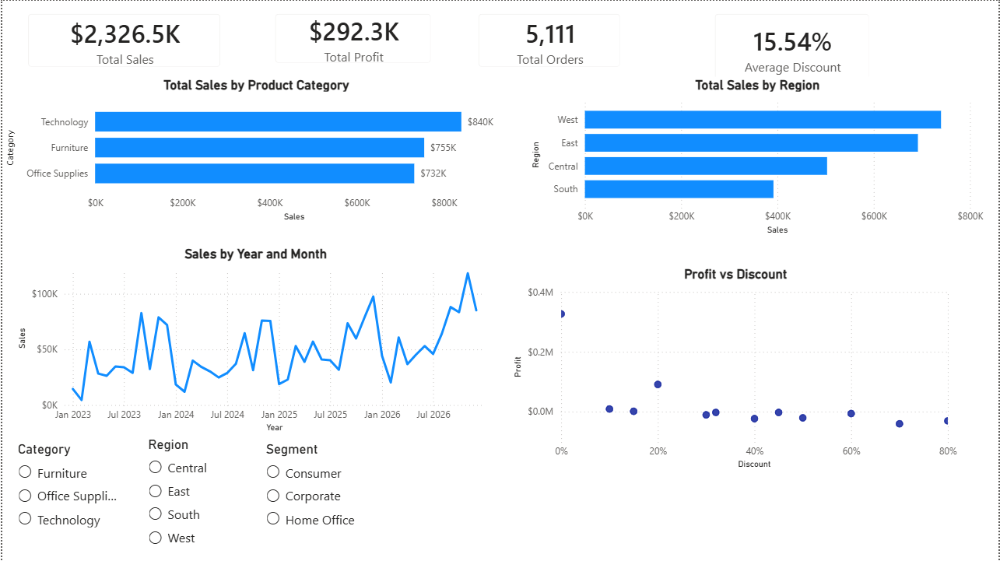

# Retail Sales Performance Dashboard

Interactive dashboard analysing retail sales performance using Power BI.

**Author:** Nicholas Stephanou  
**Date:** July 2026

## 1. Project Overview
This project analyses retail sales data using Power BI to identify trends in sales, profitability, regional performance, and the impact of discounts on profit. The goal is to provide business stakeholders with an interactive dashboard that supports data-driven decision making.

---

## 2. Data Preparation

- Imported the dataset into Power BI.
- Cleaned the data using Power Query.
- Checked data types.
- Checked for missing values.
- Created relationships

---

## 3. Dashboard

**Figure 1**. Final interactive Power BI dashboard used to analyse retail sales performance.

The dashboard was designed to provide an interactive overview of retail sales performance. It enables users to monitor key business metrics, compare performance across product categories and regions, identify sales trends over time, and investigate the relationship between discounts and profitability.

## KPI Cards

The KPI cards provide an executive summary of the company's overall performance.

- Total Sales – Displays the total revenue generated during the selected period.
- Total Profit – Shows the overall profit earned from sales.
- Total Orders – Indicates the total number of customer orders.
- Average Discount – Displays the average discount applied across all orders.

These KPIs update dynamically when filters or slicers are applied, allowing users to analyse specific categories, regions, or customer segments.

## Sales and Profit by Product Category

This chart compares total sales across the three product categories.

Its purpose is to identify which categories generate the highest revenue

## Sales by Region

This chart compares sales performance across geographical regions.

It enables users to identify the strongest and weakest performing regions and supports regional performance analysis.

## Sales by Year and Month

This line chart displays monthly sales over time.

It helps identify long-term growth trends, seasonal patterns, and periods of unusually high or low sales.

## Profit vs Discount

This scatter plot explores the relationship between discounts and profitability.

It helps determine whether larger discounts are associated with lower profits and highlights transactions where high discounts may reduce profitability.

## Interactive Slicers

The dashboard includes slicers for:

- Product Category
- Region
- Customer Segment

These allow users to filter all dashboard visuals simultaneously and perform interactive analysis from different business perspectives.

---
## 4. Key Insights

### Insight 1

Technology generated the highest sales, making it the strongest-performing product category.

### Insight 2

Sales show an overall upward trend with recurring declines around January, suggesting a possible seasonal effect.

### Insight 3

The West region generated the highest sales, while South generated the lowest.

### Insight 4

Higher discounts appear to be associated with lower profitability, suggesting that excessive discounting may reduce profit margins.

---

## 5. Recommendations

- Review the current discount strategy to ensure that discounts improve sales without unnecessarily reducing profitability.

- Investigate the recurring January decline in sales and evaluate whether targeted seasonal promotions could increase demand.

- Identify the factors contributing to the West region's strong performance and assess whether similar strategies can be applied in lower-performing regions.

## 6. Skills Demonstrated

### Tools

- Power BI
- Power Query

### Techniques

- Data Cleaning
- Data Visualization
- KPI Development
- Dashboard Design
- Business Analysis
- Trend Analysis
- Interactive Reporting

## Data Source

Dataset: Sample Superstore Dataset

Source:
https://public.tableau.com/app/learn/sample-data?qt-overview_resources=1&utm_source=chatgpt.com

The dataset is publicly available and has been used for educational and portfolio purposes.

